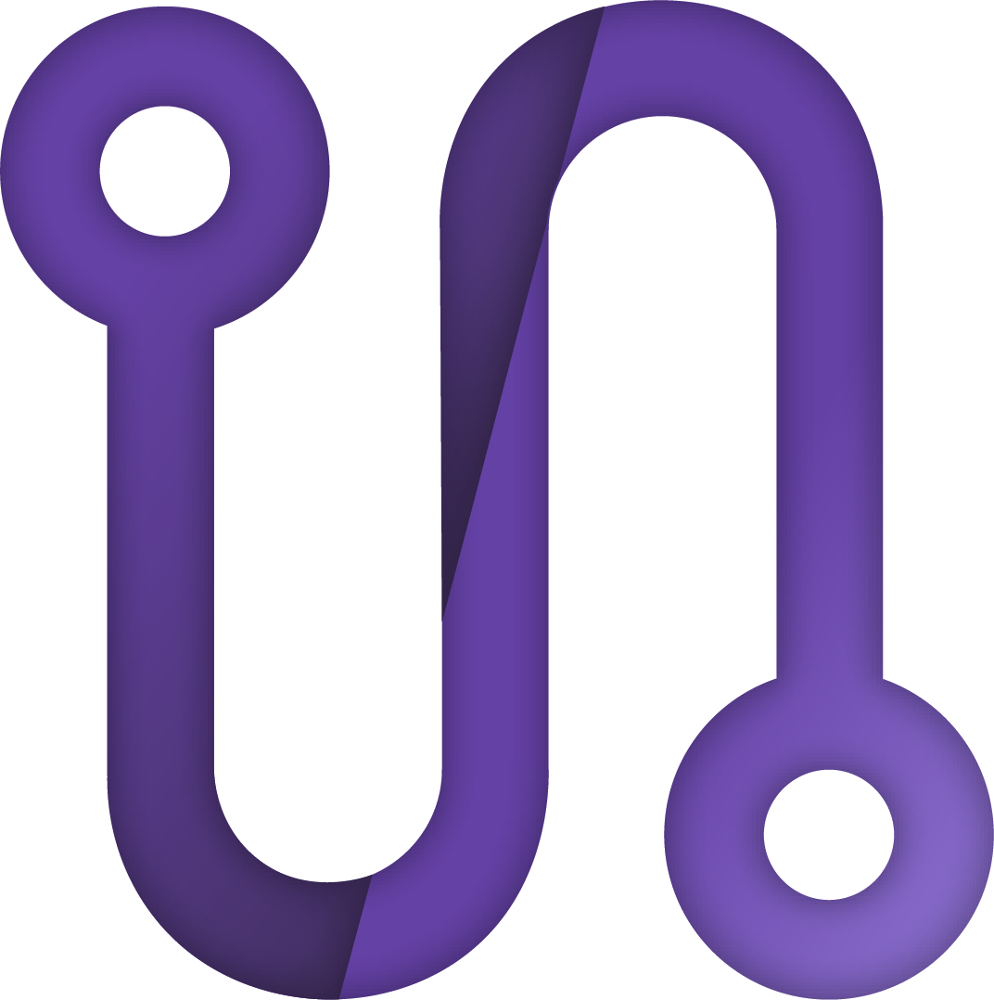

# Mov'interact
Mov'interact, la plateforme de film interactive du projet FMV Jeux vidéos - MediaNova.

## Demo link:
Access my site at [api.fmv.medianova.xyz/api](api.fmv.medianova.xyz/api).

## Table of Content:

- [About The App](#about-the-app)
- [Screenshots](#screenshots)
- [Technologies](#technologies)
- [Setup](#setup)
- [Status](#status)
- [Credits](#credits)
- [License](#license)

## About The App
Mov'interact a été créé dans le but d'héberger et de publier des films interactifs en ligne
et que des utilisateurs puissent regarder, partager et apprécier ces films.

## Screenshots
``

## Setup
Clone down this repository. You will need `node` and `npm` installed globally on your machine.

Installation:

`npm install` or `yarn install`

Start the app:

```bash
yarn start 
# or 
npm run start 
```

Runs the app in the development mode.\
Open [http://localhost:3000](http://localhost:3000) to view it in the browser.

```bash
yarn build 
# or 
npm run build 
```

Builds the app for production to the `build` folder.\
It correctly bundles React in production mode and optimizes the build for the best performance.\
The build is minified and the filenames include the hashes.\
See the section about [deployment](https://facebook.github.io/create-react-app/docs/deployment) for more information.

```bash
yarn dev
# or 
npm run dev 
```

Launch `start` script then `electron` script

```bash
yarn electron
# or 
npm run electron 
```

Open the Electron window w/ DeveloperTools

## Status
Mov'interact is still in progress. `Version 2` will be out soon.

## Credits
List of contributors:
- [Louise Baulan](https://gitlab.com/fayah)
- [Colin Varange](https://gitlab.com/Co-7)
- [Gianni Scantamburlo](https://gitlab.com/XDayonline)
- [Nicolas Notararigo](https://gitlab.com/neerfix)

## License

MIT license
